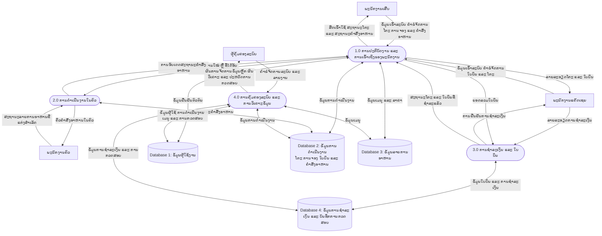

# TonNam SRMS — ແຜນຜັງການໄຫຼຂອງຂໍ້ມູນ ລະດັບ 0

> ແຜນຜັງສະຫຼຸບແບບກະທັດຮັດ ສຳລັບໃຊ້ໃນໜ້າເອກະສານ Word ໜຶ່ງໜ້າ ໂດຍສະແດງແຫຼ່ງຈັດເກັບຂໍ້ມູນໃນລະດັບເຊີງຕັກກະ.

> **ຟອນຕ໌ຂອງແຜນຜັງ:** Mermaid ຖືກຕັ້ງໃຫ້ໃຊ້ຟອນຕ໌ **Phetsarath** ຂະໜາດ **25px**. ກ່ອນສົ່ງອອກເປັນຮູບພາບ ຫຼື SVG ເພື່ອນຳໄປໃສ່ Word, ເຄື່ອງ ຫຼື ໜ້າເວັບທີ່ render Mermaid ຕ້ອງຕິດຕັ້ງ ຫຼື ໂຫຼດຟອນຕ໌ Phetsarath ກ່ອນ.

## ຄຳອະທິບາຍແບບເຕັມ

### ພາບລວມຂອງລະບົບ

DFD ລະດັບ 0 ນີ້ ສະແດງພາບລວມການໄຫຼຂອງຂໍ້ມູນໃນລະບົບ TonNam Smart Restaurant Management System (SRMS). ລະບົບເຊື່ອມໂຍງຜູ້ໃຊ້ 4 ບົດບາດ ຄື ພະນັກງານເສີບ, ພະນັກງານຄົວ, ພະນັກງານແຄັດເຊຍ ແລະ ຜູ້ຄຸ້ມຄອງລະບົບ ເພື່ອໃຫ້ການດຳເນີນງານຂອງຮ້ານໃຊ້ຂໍ້ມູນຊຸດດຽວກັນ. ລະບົບຄອບຄຸມການຢືນຢັນຕົວຕົນ, ການຈັດການໂຕະ ແລະ ການຈອງ, ຄຳສັ່ງອາຫານ, ການອັບເດດຈາກຄົວ, ການຊຳລະເງິນ, ການຄຸ້ມຄອງຂໍ້ມູນ, ການວິເຄາະ ແລະ ບັນທຶກການກວດສອບ.

### ຂໍ້ມູນນຳເຂົ້າ, ການປະມວນຜົນ ແລະ ຂໍ້ມູນສົ່ງອອກ

- **ຂໍ້ມູນນຳເຂົ້າ:** ພະນັກງານສົ່ງຂໍ້ມູນເຂົ້າລະບົບ, ຄຳຂໍຈັດການໂຕະ ແລະ ການຈອງ, ລາຍການອາຫານ ແລະ ໝາຍເຫດ, ສະຖານະອາຫານຈາກຄົວ, ລາຍລະອຽດການຊຳລະເງິນ ແລະ ຄຳຂໍຈັດການລະບົບ ຫຼື ລາຍງານ.
- **ການປະມວນຜົນ:** ລະບົບກວດສອບຕົວຕົນ ແລະ ສິດການນຳໃຊ້ຕາມບົດບາດ, ນຳໃຊ້ກົດການດຳເນີນງານຂອງຮ້ານ, ອັບເດດແຫຼ່ງຈັດເກັບຂໍ້ມູນ ແລະ ບັນທຶກການປ່ຽນແປງທີ່ສຳຄັນ.
- **ຂໍ້ມູນສົ່ງອອກ:** ຜູ້ໃຊ້ໄດ້ຮັບຜົນການເຂົ້າລະບົບ, ລາຍລະອຽດໂຕະ ແລະ ໃບບິນ, ຄິວຄົວ, ສະຖານະຄຳສັ່ງອາຫານ, ການຢືນຢັນການຊຳລະເງິນ, ລາຍງານ ແລະ ປະຫວັດການກວດສອບ. ຜູ້ໃຊ້ທີ່ກ່ຽວຂ້ອງໄດ້ຮັບການອັບເດດແບບທັນທີ.

### ໜ່ວຍງານພາຍນອກ

| ໜ່ວຍງານ | ຂໍ້ມູນທີ່ສົ່ງເຂົ້າລະບົບ | ຂໍ້ມູນທີ່ໄດ້ຮັບຈາກລະບົບ |
| --- | --- | --- |
| **ພະນັກງານເສີບ** | ຂໍ້ມູນເຂົ້າລະບົບ, ຄຳຂໍສະຖານະໂຕະ, ລາຍລະອຽດການຈອງ, ຄຳຂໍເປີດໃບບິນ, ລາຍການອາຫານ ແລະ ໝາຍເຫດ | ຜົນການເຂົ້າລະບົບ, ລາຍລະອຽດໂຕະ ແລະ ໃບບິນ, ແລະ ສະຖານະຄຳສັ່ງອາຫານແບບທັນທີ |
| **ພະນັກງານຄົວ** | ສະຖານະລາຍການອາຫານທີ່ແຕ່ງສຳເລັດ | ຄິວຄຳສັ່ງອາຫານໃໝ່ ຫຼື ທີ່ໄດ້ອັບເດດ ພ້ອມລາຍລະອຽດອາຫານ |
| **ພະນັກງານແຄັດເຊຍ** | ຂໍ້ມູນເຂົ້າລະບົບ, ຄຳຂໍຈັດການໂຕະ ແລະ ໃບບິນ, ວິທີຊຳລະເງິນ ແລະ ຈຳນວນເງິນທີ່ຮັບ | ລາຍລະອຽດໂຕະ ແລະ ໃບບິນ, ໃບຮັບເງິນ ແລະ ການຢືນຢັນການຊຳລະເງິນ |
| **ຜູ້ຄຸ້ມຄອງລະບົບ** | ຄຳຂໍຈັດການຜູ້ໃຊ້, ເມນູ, ໂຕະ, ການຈອງ ແລະ ລາຍງານ | ຜົນການຈັດການຂໍ້ມູນຫຼັກ, ຜົນວິເຄາະການດຳເນີນງານ ແລະ ປະຫວັດການກວດສອບ |

### ຂະບວນການຫຼັກ

| ຂະບວນການ | ໜ້າທີ່ໂດຍລະອຽດ |
| --- | --- |
| **1.0 ການປະຕິບັດງານ ແລະ ການເຂົ້າເຖິງຂອງພະນັກງານ** | ກວດສອບຕົວຕົນພະນັກງານ, ກຳນົດສິດຕາມບົດບາດ ແລະ ຈັດການວຽກປະຈຳວັນ ເຊັ່ນ ໂຕະ, ການຈອງ, ໃບບິນ, ການເບິ່ງເມນູ ແລະ ການສ້າງ ຫຼື ແກ້ໄຂຄຳສັ່ງອາຫານ. ຂະບວນການນີ້ສົ່ງຄຳສັ່ງອາຫານໄປຫາຄົວ ແລະ ສົ່ງສະຖານະກັບໄປຫາພະນັກງານໜ້າຮ້ານ. |
| **2.0 ການດຳເນີນງານໃນຄົວ** | ຮັບຄຳສັ່ງອາຫານໃໝ່ ຫຼື ທີ່ໄດ້ແກ້ໄຂ, ສະແດງຄິວວຽກໃນຄົວ ແລະ ບັນທຶກສະຖານະລາຍການອາຫານທີ່ແຕ່ງສຳເລັດ. ສະຖານະທີ່ອັບເດດຈະຖືກສົ່ງກັບໄປໃຫ້ພະນັກງານທີ່ກ່ຽວຂ້ອງ. |
| **3.0 ການຊຳລະເງິນ ແລະ ໃບບິນ** | ນຳໃຊ້ຍອດລວມຂອງໃບບິນເພື່ອກວດສອບການຊຳລະດ້ວຍເງິນສົດ, QR PromptPay ຫຼື ການຊຳລະແບບປະສົມ. ເມື່ອຊຳລະສຳເລັດ ລະບົບຈະບັນທຶກຂໍ້ມູນການຊຳລະ, ປ່ຽນສະຖານະໃບບິນ ແລະ ອັບເດດສະຖານະໂຕະທີ່ກ່ຽວຂ້ອງ. |
| **4.0 ການຄຸ້ມຄອງລະບົບ ແລະ ການວິເຄາະຂໍ້ມູນ** | ຈັດການຂໍ້ມູນຫຼັກຂອງຜູ້ໃຊ້ ແລະ ເມນູ, ຈັດການຂໍ້ມູນການດຳເນີນງານ, ສ້າງຜົນວິເຄາະຈາກຂໍ້ມູນຮ້ານ ແລະ ເປີດໃຫ້ກວດສອບປະຫວັດການດຳເນີນການທີ່ສຳຄັນ. |

### ແຫຼ່ງຈັດເກັບຂໍ້ມູນເຊີງຕັກກະ

| ແຫຼ່ງຂໍ້ມູນ | ເນື້ອໃນ ແລະ ຈຸດປະສົງ |
| --- | --- |
| **Database 1: ຂໍ້ມູນຜູ້ໃຊ້ງານ** | ເກັບລາຍລະອຽດບັນຊີພະນັກງານ, ບົດບາດ ແລະ ສະຖານະບັນຊີ ເພື່ອໃຊ້ໃນການຢືນຢັນຕົວຕົນ ແລະ ກຳນົດສິດ. |
| **Database 2: ຂໍ້ມູນການດຳເນີນງານ** | ເກັບຂໍ້ມູນໂຕະ, ການຈອງ, ໃບບິນ, ຄຳສັ່ງອາຫານ ແລະ ລາຍການອາຫານ ເພື່ອຮອງຮັບລຳດັບການໃຫ້ບໍລິການຂອງຮ້ານ. |
| **Database 3: ຂໍ້ມູນລາຍການອາຫານ** | ເກັບໝວດໝູ່ອາຫານ, ລາຄາ, ສະຖານະພ້ອມຂາຍ ແລະ ສະຖານະໝົດ ເພື່ອໃຊ້ໃນການຮັບຄຳສັ່ງອາຫານ ແລະ ການຈັດການເມນູ. |
| **Database 4: ຂໍ້ມູນການຊຳລະເງິນ ແລະ ບັນທຶກການກວດສອບ** | ເກັບລາຍການຊຳລະເງິນ ແລະ ບັນທຶກການກວດສອບສຳລັບການດຳເນີນງານທີ່ສຳຄັນ ເຊັ່ນ ການຊຳລະເງິນ, ການຍົກເລີກ ແລະ ການແກ້ໄຂໃບບິນ. |

### ລຳດັບການໄຫຼຂອງຂໍ້ມູນຫຼັກ

1. ພະນັກງານຢືນຢັນຕົວຕົນກ່ອນເຂົ້າໃຊ້ຟັງຊັນຕາມສິດຂອງບົດບາດຕົນ.
2. ພະນັກງານເສີບ ຫຼື ພະນັກງານແຄັດເຊຍ ຈັດການໂຕະ ແລະ ໃບບິນ ຈາກນັ້ນສ້າງຄຳສັ່ງອາຫານຈາກເມນູທີ່ພ້ອມຂາຍ.
3. ຄຳສັ່ງອາຫານຖືກສົ່ງໄປຫາຄົວ; ພະນັກງານຄົວລະບຸລາຍການທີ່ແຕ່ງສຳເລັດ ແລະ ລະບົບສົ່ງສະຖານະກັບໄປໃຫ້ພະນັກງານທີ່ກ່ຽວຂ້ອງແບບທັນທີ.
4. ພະນັກງານແຄັດເຊຍຮັບຊຳລະເງິນໂດຍອ້າງອີງຍອດລວມຂອງໃບບິນ. ເມື່ອການຊຳລະສຳເລັດ ລະບົບຈະອັບເດດໃບບິນ ຂໍ້ມູນການຊຳລະ ແລະ ສະຖານະໂຕະ.
5. ຜູ້ຄຸ້ມຄອງລະບົບຈັດການຂໍ້ມູນຫຼັກ ແລະ ກວດສອບລາຍງານ ກັບ ບັນທຶກການກວດສອບ ເພື່ອຕິດຕາມການດຳເນີນງານ.

## ຄຳແນະນຳສຳລັບ Word

ແນະນຳໃຫ້ໃຊ້ກະດາດ A4 ແນວນອນ, ຕັ້ງຂອບກະດາດແບບແຄບ ແລະ ປັບຂະໜາດແຜນຜັງໃຫ້ພໍດີກັບຄວາມກວ້າງຂອງໜ້າ. ຄວນໃຊ້ DFD Level 0 ນີ້ໃນເນື້ອໃນຫຼັກ ແລະ ເກັບ DFD Level 1 ໄວ້ໃນພາກຜະໜວກ ຫຼື ສ່ວນທີ່ຕ້ອງອະທິບາຍການໄຫຼຂອງຂໍ້ມູນຢ່າງລະອຽດ.
