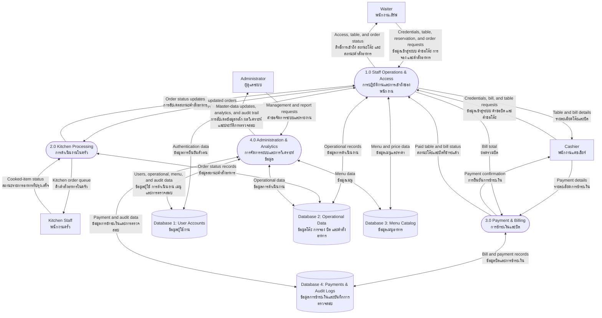

# TonNam SRMS — DFD Level 0 / แผนภาพการไหลของข้อมูลระดับ 0

> A compact functional overview for a single Word page. This version uses logical data stores to show where the system keeps its information.
>
> แผนภาพภาพรวมแบบกระชับสำหรับวางใน Word หนึ่งหน้า โดยแสดงแหล่งจัดเก็บข้อมูลในระดับเชิงตรรกะ

## Detailed Explanation / คำอธิบายแบบเต็ม

### System Overview / ภาพรวมของระบบ

This DFD Level 0 presents the high-level information flow of the TonNam Smart Restaurant Management System (SRMS). The system connects four staff roles—Waiter, Kitchen Staff, Cashier, and Administrator—so that restaurant operations use one shared set of data. It covers authentication, table and reservation handling, order processing, kitchen updates, payment, administration, analytics, audit logging, and real-time status updates.

DFD Level 0 นี้แสดงภาพรวมการไหลของข้อมูลของระบบ TonNam Smart Restaurant Management System (SRMS) โดยเชื่อมโยงผู้ใช้งาน 4 บทบาท ได้แก่ พนักงานเสิร์ฟ พนักงานครัว พนักงานแคชเชียร์ และผู้ดูแลระบบ เพื่อให้การดำเนินงานของร้านใช้ข้อมูลชุดเดียวกัน ครอบคลุมการยืนยันตัวตน การจัดการโต๊ะและการจอง การจัดการคำสั่งอาหาร การอัปเดตจากครัว การชำระเงิน การจัดการระบบ การวิเคราะห์ข้อมูล การบันทึกการตรวจสอบ และการอัปเดตสถานะแบบเรียลไทม์

### Input, Processing, and Output / ข้อมูลนำเข้า การประมวลผล และข้อมูลส่งออก

- **Input / ข้อมูลนำเข้า:** Staff provide login credentials, table and reservation requests, order items and notes, cooked-item status, payment details, and administration or reporting requests. พนักงานส่งข้อมูลเข้าสู่ระบบ คำขอจัดการโต๊ะและการจอง รายการอาหารและหมายเหตุ สถานะอาหารที่ปรุงเสร็จ รายละเอียดการชำระเงิน และคำขอจัดการระบบหรือรายงาน
- **Processing / การประมวลผล:** The system checks identity and role permissions, applies business rules, updates logical data stores, and records important changes. ระบบตรวจสอบตัวตนและสิทธิ์ตามบทบาท ใช้กฎการดำเนินงานของร้าน อัปเดตแหล่งจัดเก็บข้อมูล และบันทึกการเปลี่ยนแปลงที่สำคัญ
- **Output / ข้อมูลส่งออก:** Users receive access results, table and bill details, kitchen queues, order status, payment confirmation, reports, and audit history. Relevant users receive operational changes in real time. ผู้ใช้จะได้รับผลการเข้าสู่ระบบ รายละเอียดโต๊ะและบิล คิวงานครัว สถานะคำสั่งอาหาร การยืนยันการชำระเงิน รายงาน และประวัติการตรวจสอบ โดยผู้ใช้ที่เกี่ยวข้องได้รับการอัปเดตการดำเนินงานแบบเรียลไทม์

### External Entities / หน่วยงานภายนอกระบบ

| Entity / หน่วยงาน | Data sent to the system / ข้อมูลที่ส่งเข้าสู่ระบบ | Information received / ข้อมูลที่ได้รับจากระบบ |
| --- | --- | --- |
| **Waiter / พนักงานเสิร์ฟ** | Login credentials, table status requests, reservation details, bill requests, order items, and item notes. ข้อมูลเข้าสู่ระบบ คำขอสถานะโต๊ะ รายละเอียดการจอง คำขอเปิดบิล รายการอาหาร และหมายเหตุ | Access result, table and bill details, and live order status. ผลการเข้าสู่ระบบ รายละเอียดโต๊ะและบิล และสถานะคำสั่งอาหารแบบเรียลไทม์ |
| **Kitchen Staff / พนักงานครัว** | Cooked-item status. สถานะรายการอาหารที่ปรุงเสร็จ | Queue of new or updated orders and item details. คิวคำสั่งอาหารใหม่หรือที่อัปเดต พร้อมรายละเอียดรายการอาหาร |
| **Cashier / พนักงานแคชเชียร์** | Login credentials, table and bill requests, payment method, and received amount. ข้อมูลเข้าสู่ระบบ คำขอจัดการโต๊ะและบิล วิธีชำระเงิน และจำนวนเงินที่รับ | Table and bill details, payment receipt, and payment confirmation. รายละเอียดโต๊ะและบิล ใบเสร็จ และการยืนยันการชำระเงิน |
| **Administrator / ผู้ดูแลระบบ** | Requests to manage users, menus, tables, reservations, and reports. คำขอจัดการผู้ใช้ เมนู โต๊ะ การจอง และรายงาน | Master-data results, operational analytics, and audit trail. ผลการจัดการข้อมูลหลัก ผลวิเคราะห์การดำเนินงาน และประวัติการตรวจสอบ |

### Main Processes / กระบวนการหลัก

| Process / กระบวนการ | Detailed responsibility / หน้าที่โดยละเอียด |
| --- | --- |
| **1.0 Staff Operations & Access / การปฏิบัติงานและการเข้าถึงของพนักงาน** | Authenticates staff, determines access by role, and manages routine operational work: tables, reservations, bills, menu lookup, and order creation or changes. It sends new orders to the kitchen and returns status updates to floor staff. ตรวจสอบตัวตนพนักงาน กำหนดสิทธิ์ตามบทบาท และจัดการงานประจำวัน ได้แก่ โต๊ะ การจอง บิล การดูเมนู และการสร้างหรือแก้ไขคำสั่งอาหาร โดยส่งคำสั่งอาหารไปยังครัวและส่งสถานะกลับไปยังพนักงานหน้าร้าน |
| **2.0 Kitchen Processing / การดำเนินงานในครัว** | Receives new or changed orders, displays the kitchen queue, and records cooked-item status. The updated status is returned to staff operations so that relevant users can see order progress. รับคำสั่งอาหารใหม่หรือที่แก้ไข แสดงคิวงานครัว และบันทึกสถานะรายการอาหารที่ปรุงเสร็จ จากนั้นส่งสถานะที่อัปเดตกลับไปยังส่วนปฏิบัติงานเพื่อให้ผู้ใช้ที่เกี่ยวข้องเห็นความคืบหน้า |
| **3.0 Payment & Billing / การชำระเงินและบิล** | Uses the bill total to validate cash, QR PromptPay, or mixed payment. When payment is successful, it stores the payment record, changes the bill status, and updates the related table to paid. ใช้ยอดรวมของบิลเพื่อตรวจสอบการชำระด้วยเงินสด QR PromptPay หรือแบบผสม เมื่อชำระสำเร็จ ระบบจะบันทึกข้อมูลการชำระ เปลี่ยนสถานะบิล และอัปเดตสถานะโต๊ะที่เกี่ยวข้องเป็นชำระแล้ว |
| **4.0 Administration & Analytics / การจัดการระบบและการวิเคราะห์ข้อมูล** | Maintains users and menu master data, manages operational information, produces analytics from restaurant data, and allows review of the audit trail for sensitive actions. จัดการข้อมูลหลักของผู้ใช้และเมนู จัดการข้อมูลการดำเนินงาน สร้างผลวิเคราะห์จากข้อมูลของร้าน และเปิดให้ตรวจสอบประวัติการดำเนินการสำคัญ |

### Logical Data Stores / แหล่งจัดเก็บข้อมูลเชิงตรรกะ

| Data store / แหล่งจัดเก็บข้อมูล | Contents and purpose / ข้อมูลและวัตถุประสงค์ |
| --- | --- |
| **Database 1: User Accounts / ข้อมูลผู้ใช้งาน** | Staff account details, roles, and account status. Used for authentication and authorization. เก็บรายละเอียดบัญชีพนักงาน บทบาท และสถานะบัญชี เพื่อใช้ในการยืนยันตัวตนและกำหนดสิทธิ์ |
| **Database 2: Operational Data / ข้อมูลการดำเนินงาน** | Table, reservation, bill, order, and order-item records. Used to coordinate the restaurant service flow. เก็บข้อมูลโต๊ะ การจอง บิล คำสั่งอาหาร และรายการอาหาร เพื่อสนับสนุนลำดับการให้บริการของร้าน |
| **Database 3: Menu Catalog / ข้อมูลเมนูอาหาร** | Menu categories, prices, availability, and sold-out status. Used when staff create orders and when administrators maintain the menu. เก็บหมวดหมู่เมนู ราคา สถานะพร้อมขาย และสถานะหมด เพื่อใช้ในการรับคำสั่งอาหารและจัดการเมนู |
| **Database 4: Payments & Audit Logs / ข้อมูลการชำระเงินและบันทึกการตรวจสอบ** | Payment transactions and audit records for important operations such as payment, cancellation, and bill changes. เก็บรายการชำระเงินและบันทึกการตรวจสอบสำหรับการดำเนินงานสำคัญ เช่น การชำระเงิน การยกเลิก และการแก้ไขบิล |

### Main Information Flow / ลำดับการไหลของข้อมูลหลัก

1. Staff members authenticate before accessing functions permitted for their role. พนักงานยืนยันตัวตนก่อนเข้าใช้ฟังก์ชันที่อนุญาตตามบทบาทของตน
2. The Waiter or Cashier manages tables and bills, then creates an order from available menu data. พนักงานเสิร์ฟหรือแคชเชียร์จัดการโต๊ะและบิล จากนั้นสร้างคำสั่งอาหารจากข้อมูลเมนูที่พร้อมขาย
3. The order is sent to the kitchen; Kitchen Staff marks each completed item, and the system returns the status to relevant staff in real time. คำสั่งอาหารถูกส่งไปยังครัว พนักงานครัวระบุรายการที่ทำเสร็จ และระบบส่งสถานะกลับไปยังพนักงานที่เกี่ยวข้องแบบเรียลไทม์
4. The Cashier processes payment using the bill total. A successful payment updates the bill, payment record, and table status. แคชเชียร์รับชำระเงินโดยอ้างอิงยอดรวมบิล เมื่อสำเร็จ ระบบจะอัปเดตบิล ข้อมูลการชำระเงิน และสถานะโต๊ะ
5. The Administrator maintains master data and examines reports and audit logs to monitor operations. ผู้ดูแลระบบจัดการข้อมูลหลัก และตรวจสอบรายงานกับบันทึกการตรวจสอบเพื่อติดตามการดำเนินงาน

## Word Layout Recommendation / คำแนะนำสำหรับ Word

Use an A4 **landscape** page with narrow margins and fit the Mermaid diagram to the page width. Keep this Level 0 diagram in the main chapter; use the Level 1 diagram as an appendix or only when detailed process flows are required.

ใช้หน้ากระดาษ A4 **แนวนอน** ตั้งค่าขอบกระดาษแคบ และปรับแผนภาพให้พอดีกับความกว้างของหน้า แนะนำให้ใช้ Level 0 นี้ในเนื้อหาหลัก และเก็บ Level 1 ไว้ในภาคผนวกหรือส่วนที่ต้องอธิบายการไหลของข้อมูลอย่างละเอียด
