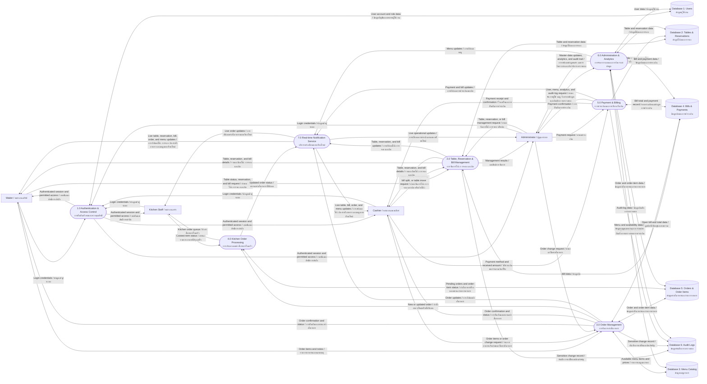

# TonNam SRMS — Data Flow Diagram Level 1 / แผนภาพการไหลของข้อมูลระดับ 1

## Diagram Explanation / คำอธิบายประกอบแผนภาพ

This Level 1 DFD decomposes the TonNam SRMS into seven major processes. It shows how staff requests are validated, processed, stored, and delivered to the relevant roles through real-time notifications.

DFD ระดับ 1 นี้แยกระบบ TonNam SRMS ออกเป็น 7 กระบวนการหลัก เพื่อแสดงการรับคำขอจากพนักงาน การตรวจสอบและประมวลผลข้อมูล การจัดเก็บข้อมูล และการแจ้งเตือนแบบเรียลไทม์ไปยังบทบาทที่เกี่ยวข้อง

### Data Collection and Processing / การรวบรวมและประมวลผลข้อมูล

- **Data collection / การรวบรวมข้อมูล:** The system receives login credentials, table and reservation requests, order items, kitchen status updates, payment details, and administration requests from staff. ระบบรับข้อมูลเข้าสู่ระบบ คำขอจัดการโต๊ะและการจอง รายการอาหาร สถานะจากครัว รายละเอียดการชำระเงิน และคำขอจัดการระบบจากพนักงาน
- **Processing / การประมวลผล:** The system verifies user access, applies restaurant business rules, updates the relevant logical data stores, records sensitive actions in the audit log, and publishes live updates to authorized users. ระบบตรวจสอบสิทธิ์ผู้ใช้งาน ใช้กฎการดำเนินงานของร้าน อัปเดตแหล่งจัดเก็บข้อมูลที่เกี่ยวข้อง บันทึกการดำเนินการสำคัญลงใน Audit Log และส่งข้อมูลอัปเดตแบบเรียลไทม์ให้ผู้ใช้ที่ได้รับสิทธิ์

### External Entities / หน่วยงานภายนอกระบบ

| Entity / หน่วยงาน | Interaction with the system / การทำงานร่วมกับระบบ |
| --- | --- |
| **Waiter / พนักงานเสิร์ฟ** | Logs in, manages table and reservation information, creates bills and orders, then receives order and table updates. เข้าสู่ระบบ จัดการข้อมูลโต๊ะและการจอง เปิดบิลและสร้างคำสั่งอาหาร จากนั้นรับข้อมูลอัปเดตของคำสั่งอาหารและโต๊ะ |
| **Kitchen Staff / พนักงานครัว** | Receives the kitchen queue and reports cooked-item status. รับคิวคำสั่งอาหารจากครัวและรายงานสถานะรายการอาหารที่ปรุงเสร็จ |
| **Cashier / พนักงานแคชเชียร์** | Manages tables and bills, accepts payment, and receives payment confirmation. จัดการโต๊ะและบิล รับชำระเงิน และรับการยืนยันผลการชำระเงิน |
| **Administrator / ผู้ดูแลระบบ** | Manages users, menus, operational data, and reviews analytics and audit logs. จัดการผู้ใช้ เมนู ข้อมูลการดำเนินงาน และตรวจสอบผลวิเคราะห์กับบันทึกการตรวจสอบ |

## Scope

This Level 1 DFD covers the staff-facing SRMS. The public marketing website is excluded because it does not currently exchange data with the API.

แผนภาพนี้ครอบคลุมระบบ SRMS สำหรับพนักงาน โดยไม่รวมเว็บไซต์ประชาสัมพันธ์ เนื่องจากปัจจุบันเว็บไซต์ไม่ได้แลกเปลี่ยนข้อมูลกับ API.
